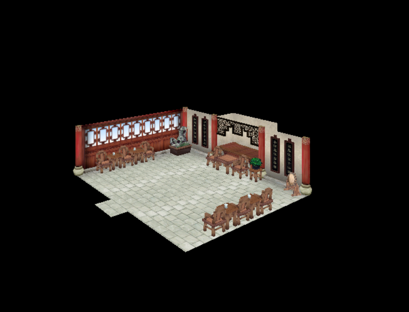
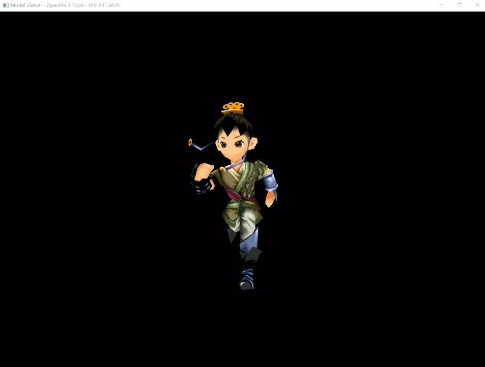

# 仙三模拟器

（刚刚开工的）《仙剑奇侠传三》开源实现。

## 声明

- 仙三模拟器并不附带任何《仙剑奇侠传三》的游戏数据。您必须拥有《仙剑奇侠传三》的正版拷贝才可以正常运行仙三模拟器。
- 仙三模拟器并非软星公司或大宇集团的官方作品。

## 相关资料

- [@zhangboyang/PAL3patch](https://github.com/zhangboyang/PAL3patch) 提供了简单有效的脱壳工具
- [仙剑三高难度吧](https://tieba.baidu.com/f?kw=%E4%BB%99%E5%89%913%E9%AB%98%E9%9A%BE%E5%BA%A6) 有一些关于仙剑三数据文件的目录结构与内容的讨论
- [这个转帖](https://tieba.baidu.com/p/5381666939?red_tag=0041464978) 分析了 `pol` 文件的部分结构
- [看雪论坛的这篇帖子](https://bbs.pediy.com/thread-157228.htm) 分析了 `cpk` 与 `sce` 的文件格式